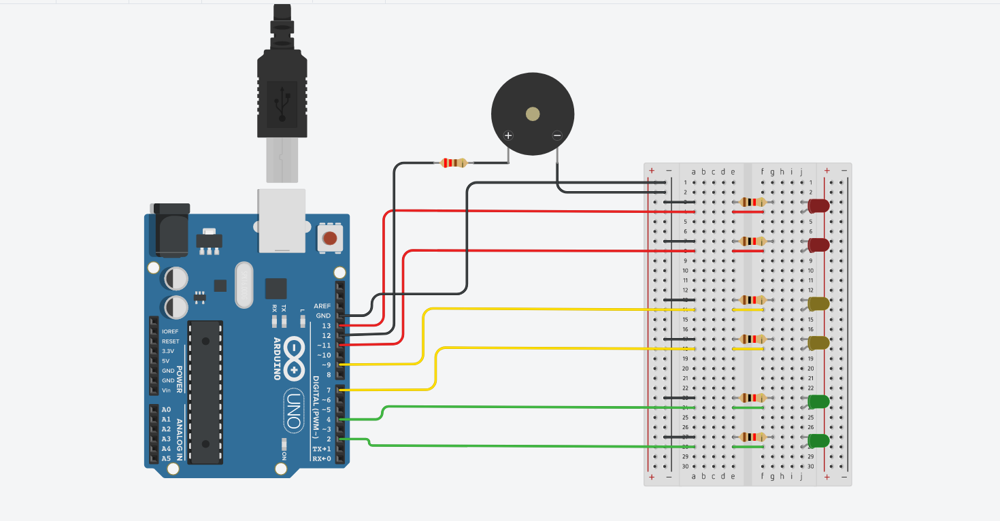

# Dojo numero 1


## Integrantes

- Uriel Nicolas Marles
- Juan Mosquella
- Lara Lopez
- Juan Mesa
- Gianfranco Moscarella

## Proyecto: Contador binario.



## Descripción

El proyecto sirve para ciclar entre los colores de un semaforo y hacer sonar un ruido para los no videntes

## Función principal

Definimos una funcion para cada color y las vamos llamando en loop para encender los led y el buzzer si corresponde
El buzzer suena durante el color rojo repetidamente y durante el amarillo mas detenidamente

```C (lenguaje en el que esta escrito)
#define LED_ROJO1 13
#define LED_ROJO2 11
#define LED_AMARILLO1 9
#define LED_AMARILLO2 7
#define LED_VERDE1 4
#define LED_VERDE2 2

void EncendidoApagadoRojo(int timer, int LED);
void EncendidoApagadoAmarillo(int timer, int LED);
void EncendidoApagadoVerde(int timer, int LED);

void setup()
{
  pinMode(10, OUTPUT);
  pinMode(6, OUTPUT);
  pinMode(LED_ROJO1, OUTPUT);
  pinMode(LED_ROJO2, OUTPUT);
  pinMode(LED_AMARILLO1, OUTPUT);
  pinMode(LED_AMARILLO2, OUTPUT);
  pinMode(LED_VERDE1, OUTPUT);
  pinMode(LED_VERDE2, OUTPUT);
}

void loop()
{
  digitalWrite(LED_ROJO1, HIGH);
  digitalWrite(LED_ROJO2, HIGH);
  delay(1000);
  digitalWrite(LED_ROJO1, LOW);
  digitalWrite(LED_ROJO2, LOW);
  delay(1000);
  tone(10, 1000);
  delay(1000);
  noTone(10);
  delay(1000);
  tone(6, 1000);
  delay(1000);
  noTone(6);
  delay(1000);
}

void EncendidoApagado (int timer, int LED){
  digitalWrite(LED_ROJO1, HIGH);
  digitalWrite(LED_ROJO2, HIGH);
  delay(1000);
  digitalWrite(LED_ROJO1, LOW);
  digitalWrite(LED_ROJO2, LOW);
  delay(1000);
}
```

## :robot: Link al proyecto

- [proyecto](https://www.tinkercad.com/things/dmgoLIgGcsh-dojo-1/editel?sharecode=rWWzi3lzdYeWcuitYQWjdzwbYWgGw77Cm75HwlfJz3k)

---

### Fuentes

- [Ayuda con todo un poco](https://chat.openai.com/).

---
